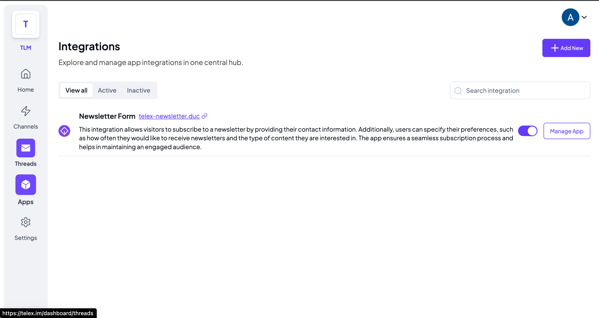
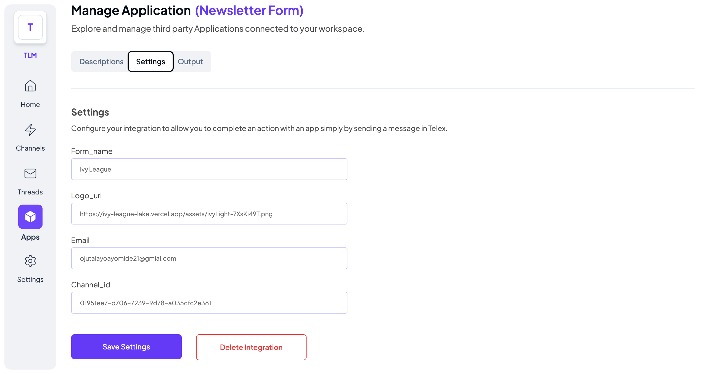
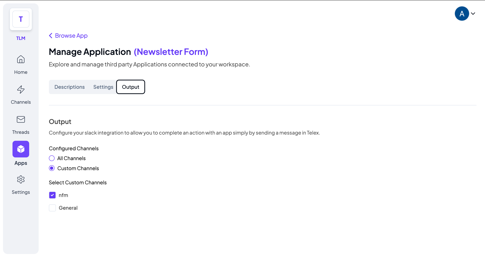
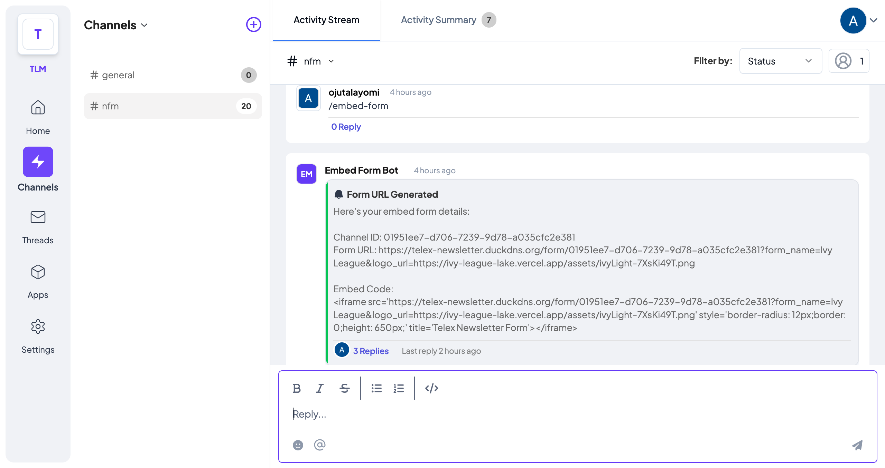
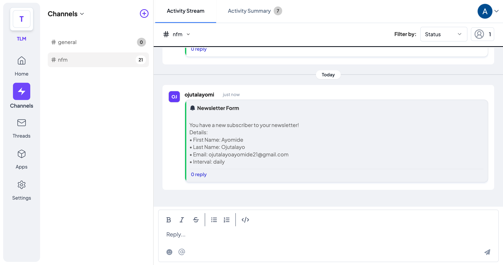

<p align="center">
  <a href="https://telex-newsletter.duckdns.org/">
    
    <h3 align="center">Newsletter Form(Embed) built with Next.js FastAPI Starter</h3>
  </a>
</p>

<p align="center">Simple Next.j 14 boilerplate that uses <a href="https://fastapi.tiangolo.com/">FastAPI</a> as the API backend.</p>

<br/>

## KEY FEATURES

Newsletter Form events monitored on telex
- Customizable subscription form
- Option to specify preferences
- Automated subscription process
- User-friendly interface

## Introduction

This is a hybrid Next.js 14 + Python template. One great use case of this is to write Next.js apps that use Python AI libraries on the backend, while still having the benefits of Next.js Route Handlers and Server Side Rendering.

## Integration URL

The Integration JSON for Formify FaaS Telex Integration is
`https://telex-newsletter.duckdns.org/api/py/integration.json`

The target url is found in the in the JSON..

## Deploy Your Own

You can clone & deploy it to Vercel with one click:

[](https://vercel.com/new/clone?repository-url=https%3A%2F%2Fgithub.com%2Fdigitros%2Fnextjs-fastapi%2Ftree%2Fmain)

## Developing Locally

You can clone & create this repo with the following command

```bash
git clone https://github.com/ojutalayomi/newsletter-form-embed.git
cd newsletter-form-embed
```

## Getting Started

First, create and activate a virtual environment:

```bash
python3 -m venv venv
source venv/bin/activate
```

Then, install the dependencies:

```bash
npm install
# or
yarn
# or
pnpm install
```

Then, run the development server(python dependencies will be installed automatically here):

```bash
npm run dev
# or
yarn dev
# or
pnpm dev
```

Open [http://localhost:3000](http://localhost:3000) with your browser to see the result.

The FastApi server will be running on [http://127.0.0.1:8000](http://127.0.0.1:8000) – feel free to change the port in `package.json` (you'll also need to update it in `next.config.js`).

## Testing

Run unit tests using:

```sh
pytest
```

To test endpoints, use tools like [Postman](https://www.postman.com/) or `curl`:

## How to use the Newsletter Form Integration

- Activate the Newsletter Form Integration in the Apps List on the Telex web platform (telex.im)
  - This is done by toggling the button besides `Manage App` button
    
- Click on its `Manage App` and navigate to the settings tab, The Integration requires three settings
  - Form Name (the name of the form)
  - Logo Url (the url of the logo you want to be displayed on the form)
  - Email (the email where you want the form data to be submitted)
  - ChannelID (the channel ID where you want the form data to be submitted)
    
- Navigate to the Output Tab and select the channels where you want to trigger the integration
  - It can also serve the channel where you want all the form data to be populated.
    
- Go to the designated channel. The command to to get the embed form detils to be embeded into your webpage is gotten by typing `/embed-form` in the channel and enter.
  

  - copy the generated iframe and embed it in your webpage.
  ```html
  <iframe src='https://telex-newsletter.duckdns.org/form/01951ee7-d706-7239-9d78-a035cfc2e381?form_name=Ivy League&logo_url=https://ivy-league-lake.vercel.app/assets/ivyLight-7XsKi49T.png' style='border-radius: 12px;border: 0;height: 650px;' title='Telex Newsletter Form'></iframe>

  - After submitting the form, you can view the submitted data in your designated channel
  

  ## Contact

For support or inquiries, reach out to [Ojutalayomi](https://github.com/ojutalayomi) or open an issue on GitHub.